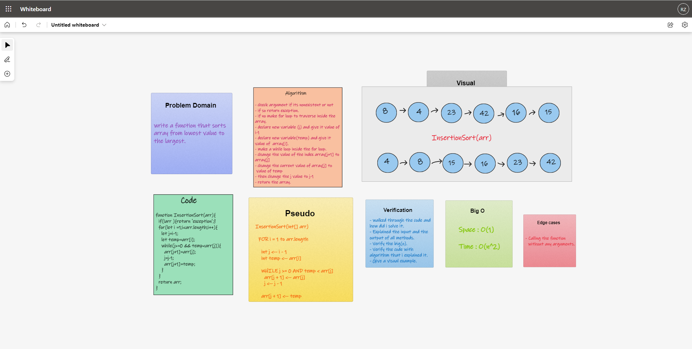

# Insertion Sort

## Challenge
write a function to sort the array from smallest to the largest 

## Approach & Efficiency

1. I understood the problem first
1. I imagined how the results should be
1. I made a visual representation.
1. I wrote an algorithm
1. I wrote the code
1. I made the tests

### Efficiency

- Space :
  - O(1)
- Time :
  - O(n^2)

  
## Whiteboard

### Test

- `npm run test`