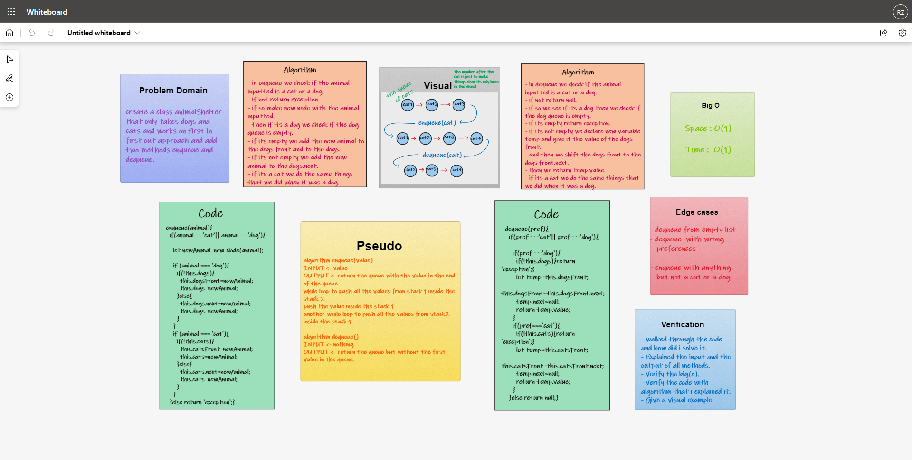

# Queue Animal Shelter

# Challenge  
- Create a class called AnimalShelter which holds only dogs and cats.
- The shelter operates using a first-in, first-out approach.
- Implement two methods. The first one, is `enqueue`, and the second one is `dequeue`. These methods wil mimic their counterpart in the `Queue` class.  

## Whiteboard Process  

  

## Approach & Efficiency  

### Approach   
1. I understood the problem first.
1. I imagined how the results should be.
1. I made a drawings of how the `queue` would be after enqueueing and dequeueing multiple `cats` and `dogs`. 
1. I wrote the algorithm.
1. I wrote the code.
1. I made the tests.

### Efficiency
- Space :  
  - O(1)
- Time :  
  - O(1)
## API  

### How to Use
- To add a cat : `<list-name>.enqueue(<animal name>, "cat");`.
- To add a dog : `<list-name>.enqueue(<animal name>, "dog");`.
- To remove an animal : `<list-name>.dequeue(<animal name>, "dog/cat");`.

### Test

- `npm run test`