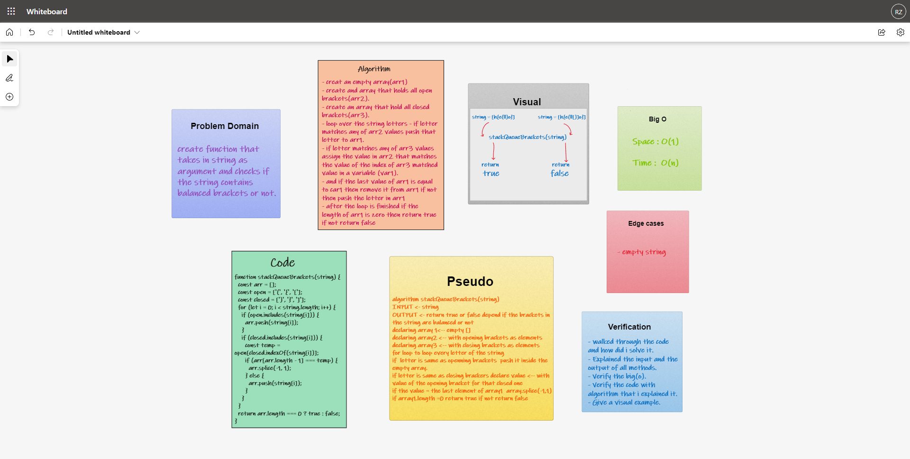

# Stack Queue Brackets

## Challenge  
- Write a function called validate brackets, representing whether or not the brackets in the string are balanced

## Approach & Efficiency  

### Approach   
1. I understood the problem first
1. I imagined how the results should be
1. I made a visual representation.
1. I wrote an algorithm
1. I wrote the code
1. I made the tests   

### Efficiency
- Space :  
  - O(1)
- Time :  
  - O(n)  

## Whiteboard  

## API  

### How to Use
- To check for a violation in a string : `validateBrackets(<string>)`  
  - It return `true` if no violations, and `false` if there is a violation.

### Test

- `npm run test`