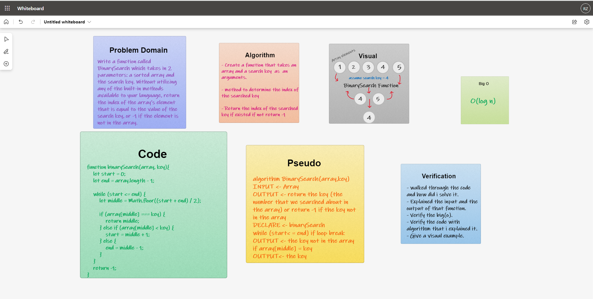

# Insert to Middle of an Array
Write a function called BinarySearch which takes in 2 parameters: a sorted array and the search key. Without utilizing any of the built-in methods available to your language, return the index of the array’s element that is equal to the value of the search key, or -1 if the element is not in the array.

## Whiteboard Process

## Approach & Efficiency
the approach that i took was looping inside the array and compare the middle element with the search key if it didn't match we go to see if the middle element smaller than the key if so we ignore the left elements in the array and we go to the elements in the right because they are bigger than the key and we repeat this step till we find a match if the array ended and no match the function will return -1 as an output (the key not exist in this array) , i used this approach because its direct to the point, the Big O space/time for this approach was O(log n)