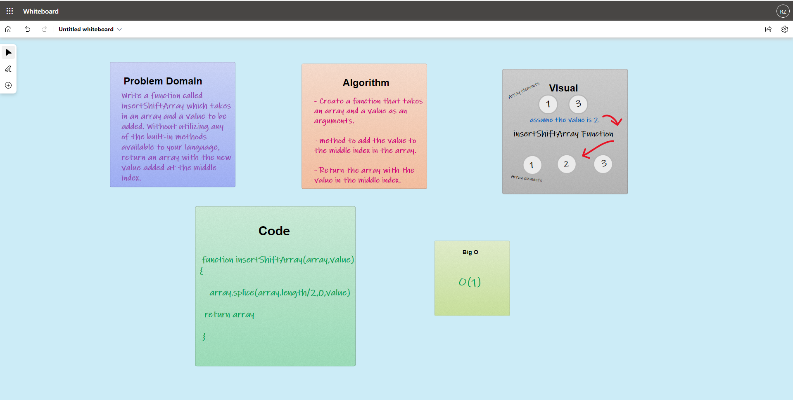

# Insert to Middle of an Array
Write a function called insertShiftArray which takes in an array and a value to be added. Without utilizing any of the built-in methods available to your language, return an array with the new value added at the middle index.

## Whiteboard Process

## Approach & Efficiency
the approach that i took was using splice to add the value to the array and i used array.length/2 as argument in splice to make it clear that the addded value goes in the middle of the array, i used this approach because its direct to the point, the Big O space/time for this approach was O(1)