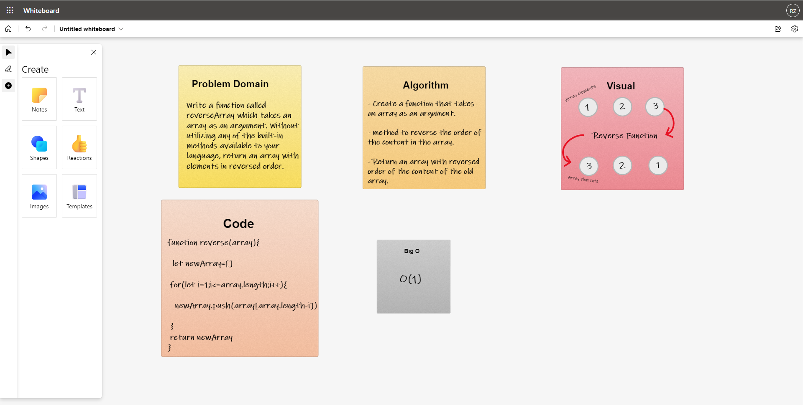

# Reverse an Array
Write a function called reverseArray which takes an array as an argument. Without utilizing any of the built-in methods available to your language, return an array with elements in reversed order.

## Whiteboard Process

## Approach & Efficiency
the approach that i took was looping inside the array  reversely and save the elements inside another array, i used this approach because its direct to the point, the Big O space/time for this approach was O(1)

