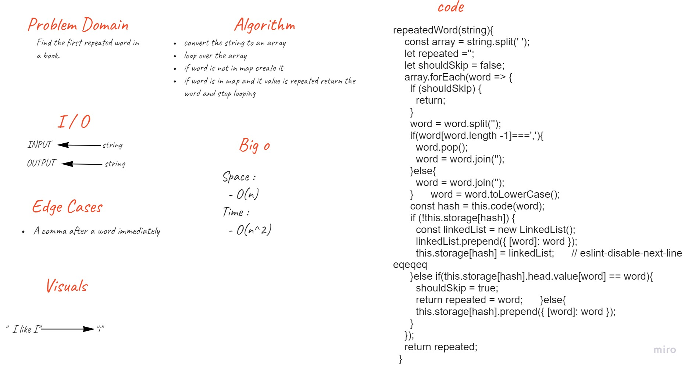

# Linked-List-Insertions

## Challenge

- Write a function called repeated word that finds the first word to occur more than once in a string.
  - It takes a `String` as an argument.
  - It return one word as a `String`.

## Whiteboard Process

## Approach & Efficiency

### Approach

1. I understood the problem first.
1. I imagined how the results should be.
1. I made a drawings of how the `linked list` would be after insertion of multiple `nodes`.
1. I wrote the algorithm.
1. I wrote the code.
1. I made the tests.

### Efficiency

- Space :
  - O(n)
- Time :
  - O(n) 

## API

### How to Use

- To check for first repeated word in a string :
  - `<name-of-hash-map>.repeatedWord(<string>)`

### Test

- `npm run test`