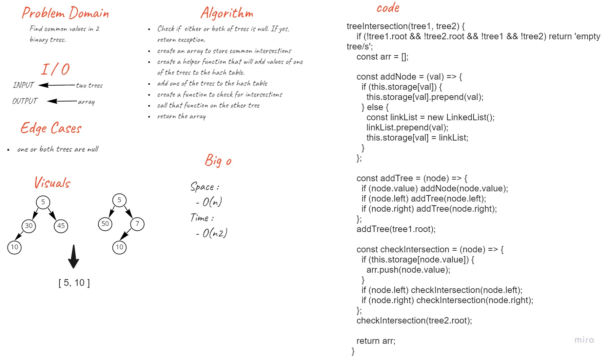

# Hashmap Tree Intersection

## Challenge

- Write a function called tree intersection
  - It takes two `binary trees`
  - It returns an array of common values between the two trees

## Whiteboard Process

## Approach & Efficiency

### Approach

1. I understood the problem first.
1. I imagined how the results should be.
1. I made a drawings of how the process of reaching the solution will be.
1. I wrote the algorithm.
1. I wrote the code.
1. I made the tests.

### Efficiency

- Space :
  - O(n)
- Time :
  - O(n)

## API

### How to Use

- To check for intersections between two trees :
  - `<name-of-hash-map>.treeIntersection(<tree1>, <tree2>)`

### Test

- `npm run test`