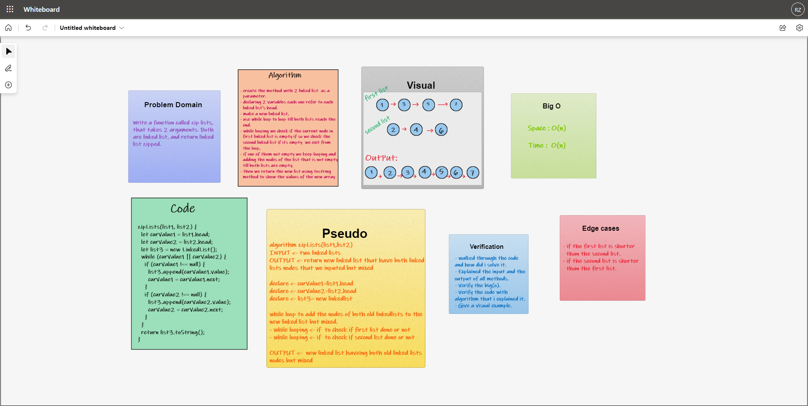

# Linked-List-Zip

## Challenge Summary  
- Write a function called zip lists, that takes 2 arguments. Both are linked list, and return linked list zipped.

## Whiteboard Process    

### Approach   
1. I understood the problem first.
1. I imagined how the results should be.
1. I made a drawings of how the `linked list` would be after the ziplist function. 
1. I wrote the algorithm.
1. I wrote the code.
1. I made the tests.

## Efficiency
- Space :  
  - O(n)
- Time :  
  - O(n)

  ## API  

### How to Use
- To output a value from a list :  
  `<list name>.zipLists(list1, list2)`

### Test

- `npm run test` 