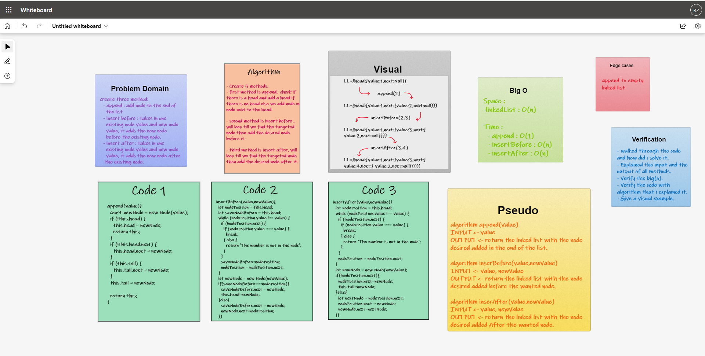

# Linked-List-Insertions 

## Challenge Summary
- create three method to the previous linked-list challenge as follow:
  - append : add node to the end of the list
  - insert before : takes in one existing node value and new node value, it adds the new node before the existing node.
  - insert after : takes in one existing node value and new node value, it adds the new node after the existing node.  

## Whiteboard Process

## Approach & Efficiency  

### Approach   
1. I understood the problem first.
1. I imagined how the results should be.
1. I made a drawings of how the `linked list` would be after insertion of multiple `nodes`. 
1. I wrote the algorithm.
1. I wrote the code.
1. I made the tests.

### Efficiency
- Space :  
  - linkedList : O(n)
- Time :  
  - append : O(1)
  - insertBefore : O(n)
  - insertAfter : O(n)

### How to Use
- To append a node : `<linked-list-name>.append(<value>);`
- To insert before : `<linked-list-name>.insertBefore(<target-value>, <new-value>);`
- To insert after : `<linked-list-name>.insertBefore(<target-value>, <new-value>);`

### Test

- `npm run test` 