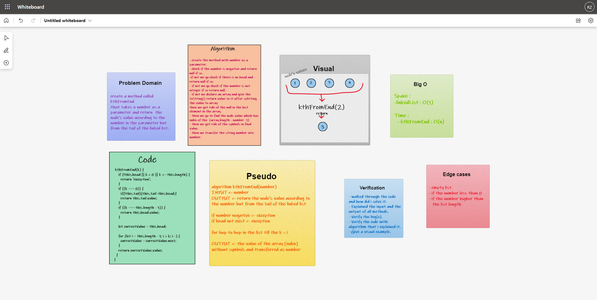

# Linked-List-Kth  

## Challenge  
- write a method called `kthFromEnd`, that takes in a single number as argument. and return the value that is `k` places from the tail of the linked list. 

## Whiteboard Process  

  

## Approach & Efficiency  

### Approach   
1. I understood the problem first.
1. I imagined how the results should be.
1. I made a drawings of how the proccess on the `linked list` would be.
1. I wrote the algorithm.
1. I wrote the code.
1. I made the tests.

### Efficiency
- Space :  
  - O(n)
- Time :  
  - O(2n)
## API  

### How to Use
- To output a value from a list :  
  `<list name>.kthFromEnd(<number>)`

### Test

- `npm run test` 