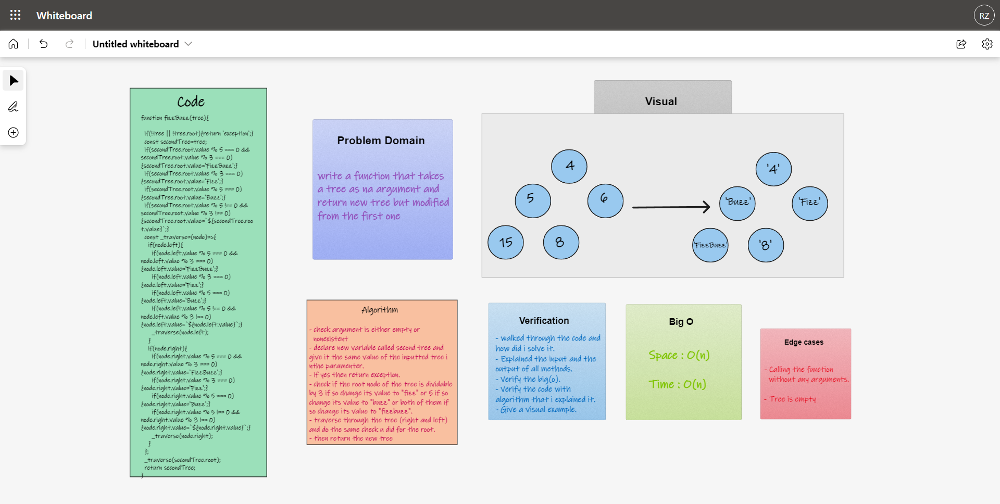

# Tree-Fizz-Buzz

## Challenge

- Conduct “FizzBuzz” on a k-ary tree while traversing through it to create a new tree.

- Set the values of each of the new nodes depending on the corresponding node value in the source tree.

## Approach & Efficiency

1. I understood the problem first
1. I imagined how the results should be
1. I made a visual representation.
1. I wrote an algorithm
1. I wrote the code
1. I made the tests

### Efficiency

- Space :
  - O(n)
- Time :
  - O(n)

## Whiteboard

### Test

- `npm run test`