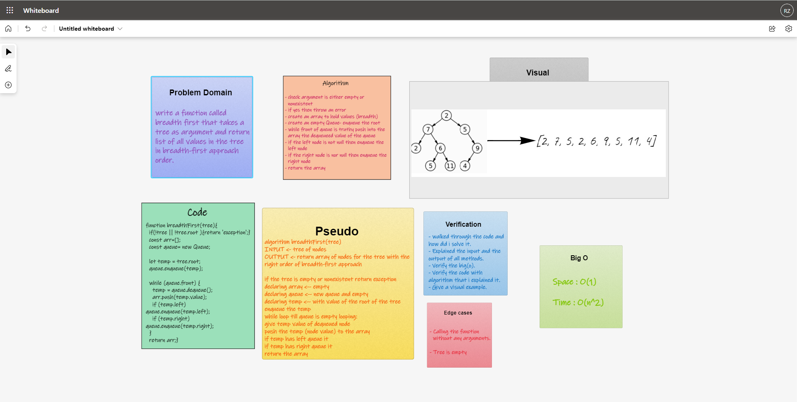

# Breadth First

## Challenge

- Create a function called breadth first that returns am array or string of tree values in breadth first traversal order.

## Approach & Efficiency

1. I understood the problem first
1. I imagined how the results should be
1. I made a visual representation.
1. I wrote an algorithm
1. I wrote the code
1. I made the tests

### Efficiency

- Space :
  - O(n)
- Time :
  - O(n^2)

## Whiteboard

### Test

- `npm run test`